<div align="right">
  <a href="./README.md">
    
  </a>
  <a href="./README.zh-CN.md">
    
  </a>
  <a href="./docs/README.md">
    
  </a>
  <a href="./docs/demo.md">
    
  </a>
</div>

# Lattice

Lattice is an open-source platform for collecting, structuring, and using high-quality training data for large-model workflows in science and materials.

It focuses on one concrete problem first: turning fragmented scientific sources into provenance-aware, training-ready datasets that can be consumed by pretraining, continued pretraining, fine-tuning, and post-training workflows.

<p>
  
</p>

## What Lattice Does

Lattice provides a single workflow for:

1. ingesting heterogeneous scientific sources
2. normalizing them into a stable schema family
3. tracking provenance, licensing, and deduplication
4. compiling reusable training views
5. running local or distributed execution
6. connecting compiled data to training workflows

## Current Scope

| Area | Status | Notes |
|---|---|---|
| Phase 1 data ingestion and compilation | ✅ Implemented | Source registry, adapters, normalization, filtering, dedup, manifests |
| Open-source science/materials source coverage | ✅ Implemented | OpenAlex, Crossref, arXiv, PubChem, OQMD, NOMAD, JARVIS, Wikidata, Europe PMC, Materials Cloud, and more |
| Local execution | ✅ Implemented | Local Python and pandas paths |
| Distributed execution | ✅ Implemented | Spark and Flink local runtimes verified |
| Phase 2 training workflows | ✅ Implemented | `pretrain`, `continue`, `finetune`, `posttrain` |
| Registry and job API | ✅ Implemented | Run registry, async submission, rerun, manifest sync |
| Workflow-spec execution | ✅ Implemented | Saved specs can be replayed or migrated across engines |
| Conversational / drag-and-drop UI | ◐ In progress | Product direction, not the current repository focus |

## Core Capabilities

| Capability | What it means in this repo |
|---|---|
| Multi-source ingestion | Fetch from APIs, archives, web resources, and structured repositories |
| Stable schema boundary | Convert raw inputs into `Document`, `StructuredRecord`, `KnowledgeRecord`, and `InstructionTrace`-style outputs |
| Training-ready compilation | Export reusable `pretrain`, `qa`, `instruction`, and `knowledge` views |
| Provenance and traceability | Preserve source identity, output manifests, registry records, and workflow specs |
| Engine portability | Run the same data-preparation logic with pandas, Spark, or Flink |
| Training orchestration | Run local reference workflows and provider-backed Phase 2 jobs |
| Reproducibility | Re-execute a saved workflow spec or rerun a registry-backed job |

## Repository Layout

| Path | Purpose |
|---|---|
| `src/lattice/` | Platform source code |
| `configs/` | Source registry and configuration files |
| `examples/` | Demo datasets and runnable examples |
| `docs/` | Structured documentation, comparisons, demos, and research notes |
| `tests/` | End-to-end and component tests |
| `figures/` | README and documentation figures |

## Quick Start

Check local runtimes:

```bash
PYTHONPATH=src python3 -m lattice engine-check
```

Run a small Phase 1 release:

```bash
PYTHONPATH=src python3 -m lattice phase1-run \
  --data-root outputs/phase1-demo \
  --registry configs/source_registry.json \
  --release-name materials-demo \
  --source openalex \
  --source pubchem \
  --compound "lithium iron phosphate" \
  --limit 1
```

Run a Phase 2 workflow:

```bash
PYTHONPATH=src python3 -m lattice phase2-run \
  --workflow finetune \
  --engine pandas \
  --input examples/training/demo_dataset \
  --output outputs/phase2-demo \
  --run-name finetune-demo \
  --model-backend local_tiny \
  --model-name tiny-local \
  --compiled-input
```

Replay a saved workflow spec:

```bash
PYTHONPATH=src python3 -m lattice run-spec \
  --spec outputs/phase2-demo/workflow_spec.json \
  --engine spark \
  --output outputs/phase2-demo-spark
```

Rerun a registry-backed job:

```bash
PYTHONPATH=src python3 -m lattice run-rerun \
  --db outputs/platform/registry.db \
  --run-id <existing-run-id>
```

## Documentation

Detailed material has been moved out of the homepage and into `docs/`.

- [Documentation index](./docs/README.md)
- [Overview](./docs/overview.md)
- [Phase 1 pipeline](./docs/phase1.md)
- [Training workflows](./docs/training.md)
- [Engine runtime notes](./docs/engines.md)
- [Source catalog](./docs/source-catalog.md)
- [Platform comparison](./docs/platform-comparison.md)
- [Storage architecture](./docs/storage_architecture.md)
- [Demo](./docs/demo.md)
- [Research notes](./docs/research/README.md)
- [Changelog](./CHANGELOG.md)

## Roadmap

- Expand open-source source coverage and quality controls in Phase 1.
- Harden Phase 2 orchestration, registry-backed execution, and provider adapters.
- Add a clearer product surface for conversation-driven and drag-and-drop workflows.

## Status

The repository is runnable today. The current local test suite covers ingestion, engines, training workflows, registry sync, workflow replay, and API rerun paths.
