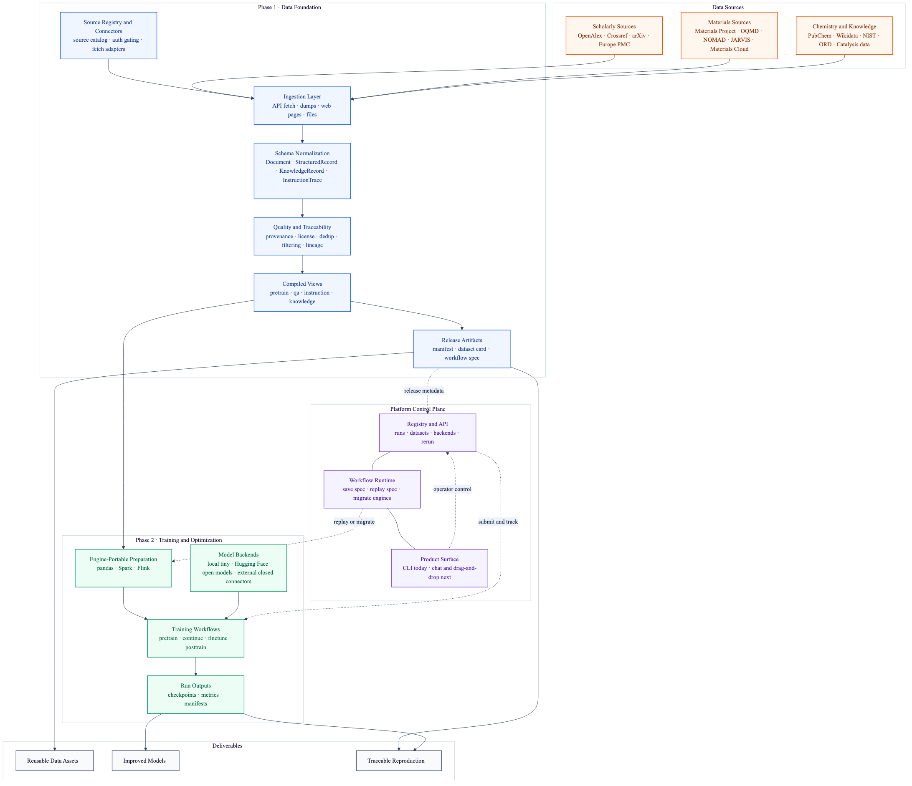

  
  
  
  
  

# Lattice

> 一个面向科学与材料领域大模型训练与优化的数据中心开源平台。

Lattice 是一个围绕大模型全生命周期构建、组织和使用高质量训练数据的平台，覆盖 pretraining、continued pretraining、fine-tuning 和 post-training。

它首先解决最基础也最困难的问题：把分散的科学数据源转成结构化、可追踪、可直接用于训练的数据。

## 项目目标

Lattice 的目标是构建一个平台，能够自动从多种数据来源收集、处理、组织和使用高质量训练数据，并让完整的大模型训练流程更容易被执行。

从长期看，Lattice 需要支持：

- 从零开始训练模型（pretraining）
- 在已有模型上继续训练（continued pretraining）
- 面向具体任务的优化（fine-tuning）
- 面向安全与对齐的后训练优化（post-training）
- 对话式交互
- 拖拽式编排
- 可复用的流程模块

理想状态下，用户可以像搭积木一样完成大模型训练与优化流程，而不需要为每一步深入编写复杂代码。

## 为什么需要这个平台

今天，科学领域的大模型训练通常同时受到两个问题的限制：

1. 数据问题  
   科学与材料数据分散在论文、预印本、数据库、数据仓库、专利和教育资源中。

2. 工作流问题  
   即使数据收集完成，用户仍然需要手动串联数据处理、pretraining、continued pretraining、fine-tuning 和 post-training 的流程。

这意味着瓶颈不只是模型设计，还包括：

- 怎么收集数据
- 怎么标准化数据
- 怎么追踪来源和许可证
- 怎么把它转成训练视图
- 怎么接到后续训练流程里

Lattice 试图同时解决数据层和工作流层的问题，先从数据基础设施做起，再扩展到训练编排层。

## 平台结构

### Phase 1：数据基础层

Phase 1 负责构建平台的数据引擎。

它的目标是自动接入异构数据源，并将它们转换为规范化、可追踪、可复用的训练数据。

Phase 1 包含：

- source registry 和 source adapter
- 从 API、文件、网页和数据库进行 ingestion
- schema normalization
- provenance、license、dedup 跟踪
- quality filtering 和数据清洗
- 面向以下任务的训练视图：
  - pretraining
  - QA
  - instruction tuning
  - knowledge records

这也是当前仓库已经在实现并可运行的部分。

### Phase 2：训练与优化层

Phase 2 在 Phase 1 之上构建模型训练与优化层。

它的目标是让用户从数据准备自然过渡到端到端的模型训练和优化流程。

Phase 2 计划支持：

- pretraining
- continued pretraining
- fine-tuning
- 面向安全与对齐的 post-training
- 数据价值评估与选择
- 数据 mixture 优化和 feeding strategy 设计
- 对话式与低代码工作流控制

简单说：

- Phase 1 回答：**如何构建高质量训练数据？**
- Phase 2 回答：**如何更容易、更有效地用这些数据训练和优化模型？**

## 当前状态

当前仓库主要实现的是平台的 **Phase 1**。

已经完成的内容包括：

- 可运行的 compiler CLI
- 稳定的 schema 边界
- provenance-aware normalization
- 过滤与去重
- 编译后的训练视图
- 初版 source registry
- 真实 source demo 抓取器
- 开源 source adapter，包括：
  - OpenAlex
  - Crossref
  - arXiv
  - PubChem
  - OQMD
  - NOMAD
  - JARVIS
  - Wikidata
- 需要 API key 的 Materials Project 集成
- 执行层支持：
  - local
  - Spark
  - Flink 兼容代码路径
- 测试与 CI

所以目前 Lattice 已经具备未来平台的 **数据基础层**，但还不是完整的训练平台。

## 平台对比

下面这张表集中比较对 Lattice 最关键的能力组合。

标记说明：

- `✅` = 明确支持
- `◐` = 部分支持
- `❌` = 未明显支持

| 平台 | 开源 | 科学/材料垂域聚焦 | 多源数据编译 | provenance / license / dedup 作为核心 | 统一覆盖 pretraining + continued pretraining + fine-tuning + post-training 的平台叙事 | 本地执行 | Spark | Flink | 对话式 / 拖拽式 |
|---|---:|---:|---:|---:|---:|---:|---:|---:|---:|
| **Lattice** | ✅ | ✅ | ✅ | ✅ | ◐ | ✅ | ✅ | ◐ | ❌ |
| NVIDIA NeMo Curator | ✅ | ❌ | ✅ | ✅ | ❌ | ✅ | ◐ | ❌ | ❌ |
| Databricks Mosaic AI | ❌ | ❌ | ◐ | ◐ | ✅ | ❌ | ✅ | ❌ | ◐ |
| H2O LLM Studio / DataStudio | ❌ | ❌ | ◐ | ◐ | ◐ | ◐ | ❌ | ❌ | ✅ |
| Sparkflows | ❌ | ❌ | ◐ | ❌ | ◐ | ◐ | ✅ | ❌ | ✅ |
| Kubeflow | ✅ | ❌ | ❌ | ❌ | ◐ | ✅ | ❌ | ❌ | ❌ |

Lattice 想做、而大多数现有平台没有完整组合在一起的能力包括：

- 把科学/材料作为第一目标场景
- 把原始 scientific sources 当成输入层，而不是只接现成训练集
- 把 provenance / license / dedup 作为平台核心能力
- 把数据编译成多种可复用训练视图
- 同时支持本地执行和分布式执行
- 从数据平台自然走向训练平台

## 每日更新

### 2026-04-13

- 创建了独立的 `lattice` 仓库并完成首次公开推送。
- 实现了可运行的第一版 Phase 1 compiler。
- 加入了 materials 示例数据和端到端测试。
- 补齐了开源仓库基础设施：
  - MIT license
  - contributing guide
  - changelog
  - CI workflow

### 2026-04-14

- 增加了 OpenAlex、arXiv、PubChem 的真实 source demo 抓取能力。
- 建立了初版 source registry 和存储架构文档。
- 接入了 OQMD、NOMAD、Materials Project 等 P0 材料数据源。
- 扩展了开源 source 覆盖，包括：
  - Crossref
  - Wikidata
  - JARVIS
- 扩展了 compiler，让 `KnowledgeRecord` 也能进入 QA、instruction 和 knowledge 视图。
- 将 PatentsView 标记为 optional connector，因为旧接口已停用并迁移到 USPTO ODP。
- 增加了本地执行层，并验证了：
  - local execution
  - Spark local execution
- 整理了 repo 结构，并把研究文档移到 `docs/research/`。
- 加入了 Phase 1 / Phase 2 路线图。

## 小型展示

### Demo A：真实数据源编译 demo

这个 demo 会从以下公开 source 拉取一小批真实数据：

- OpenAlex
- arXiv
- PubChem

然后把它们编译成训练视图。

当前结果：

- 输入记录数：`4`
- 保留记录数：`4`
- source 覆盖：
  - `arxiv: 1`
  - `openalex: 1`
  - `pubchem: 2`
- 输出视图：
  - `pretrain_view: 4`
  - `qa_view: 10`
  - `instruction_view: 4`
  - `knowledge_view: 10`

对应文件：

- [真实 source manifest](data/demo_compiled/solid_state/reports/manifest.json)

### Demo B：本地与 Spark 执行 demo

这个 demo 会把同一份规范化输入分别交给：

- local execution
- Spark local execution

当前结果：

- 输入记录数：`4`
- 保留记录数：`3`
- 丢弃记录：
  - `boilerplate: 1`
- schema 统计：
  - `Document: 1`
  - `StructuredRecord: 1`
  - `KnowledgeRecord: 1`

对应文件：

- [Local manifest](outputs/runtime-local/reports/manifest.json)
- [Spark manifest](outputs/runtime-spark/reports/manifest.json)

## 仓库结构

- `src/lattice/`: 核心代码
- `configs/`: source registry 和抓取配置
- `docs/`: 架构说明和研究文档
- `docs/research/`: proposal、survey 和 planning notes
- `examples/`: 小样例输入
- `tests/`: 单元测试和端到端测试

## 路线图

近期重点：

- 扩展 Phase 1 的开源 source coverage
- 完善 source registry 和 license gating
- 建立更强的 silver layer 做跨 source 对齐
- 发布更大的 materials 数据集
- 真正稳定 Flink runtime 支持

长期重点：

- 把 Phase 1 输出接入模型训练工作流
- 支持 pretraining、continued pretraining、fine-tuning 和 post-training
- 增加数据价值建模与 mixture 优化
- 增加对话式和拖拽式工作流控制

## 补充文档

- [Storage Architecture](docs/storage_architecture.md)
- [Engine Runtime Notes](docs/engines.md)
- [Demo Summary](docs/demo.md)
- [Platform Comparison](docs/platform-comparison.md)
- [Research Notes Index](docs/research/README.md)
